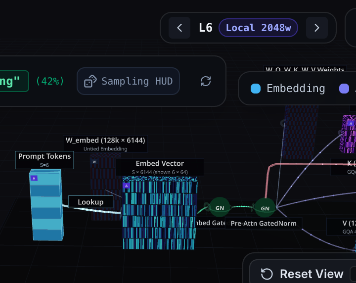
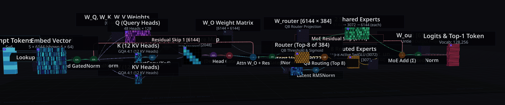
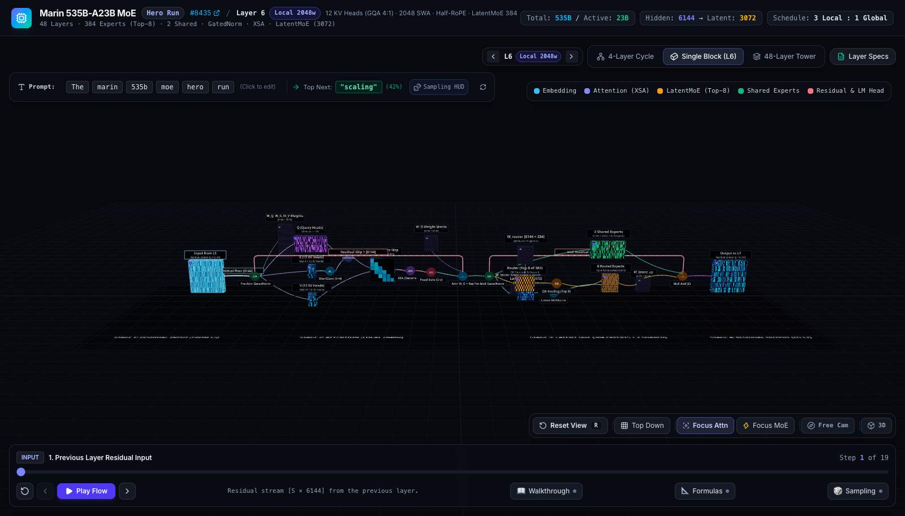
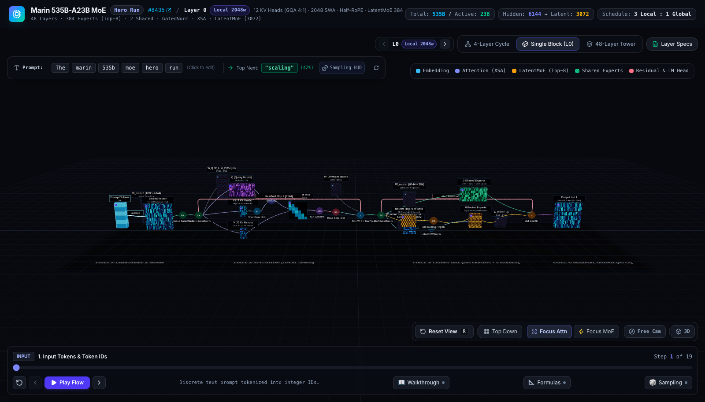
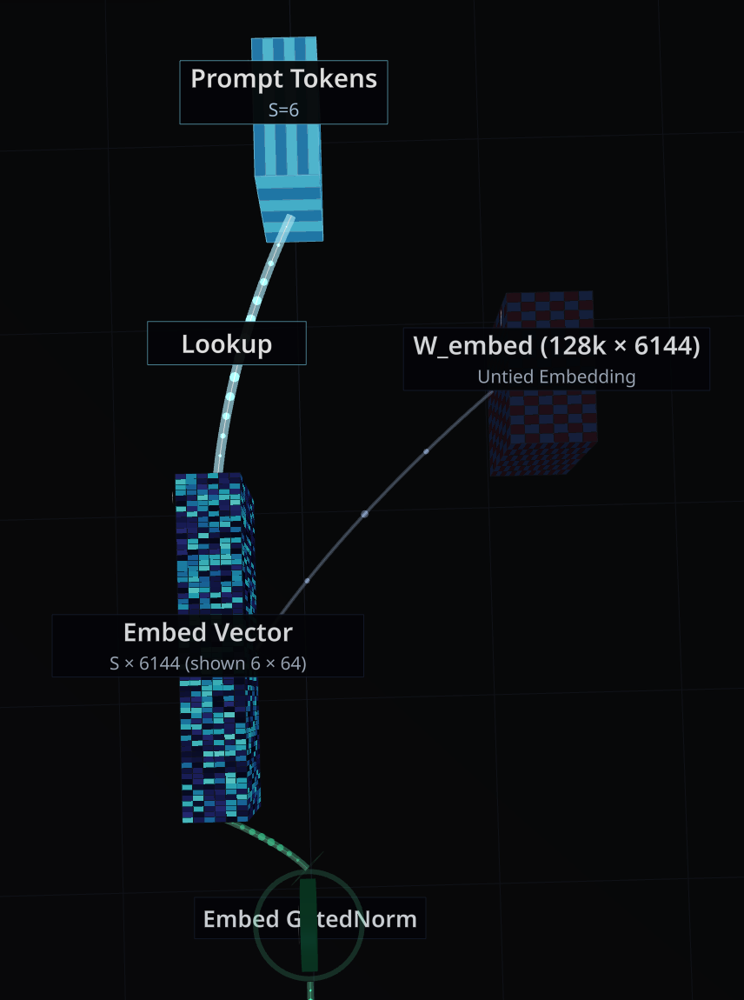
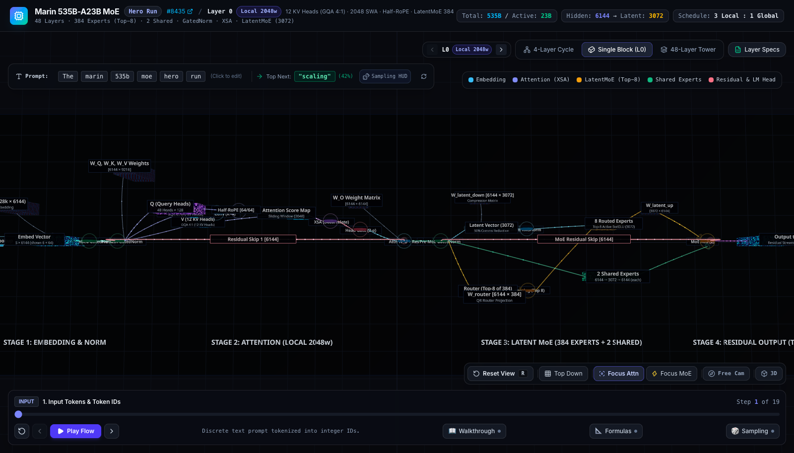
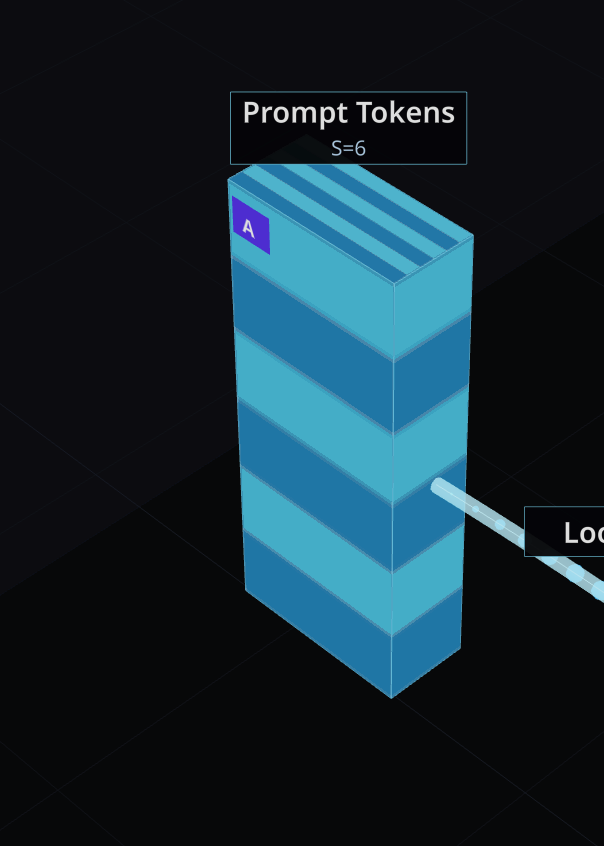
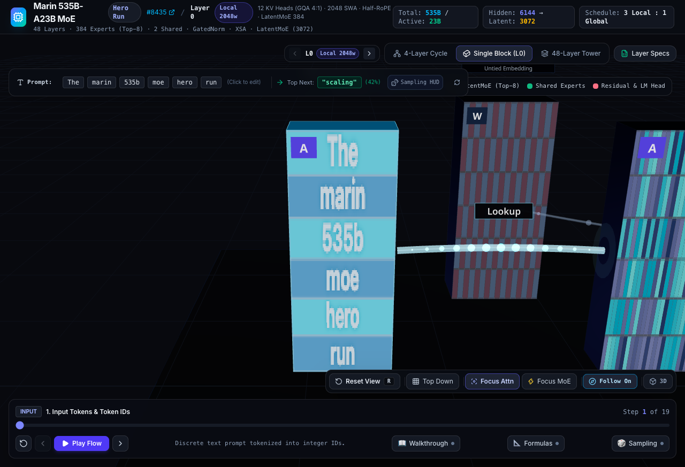
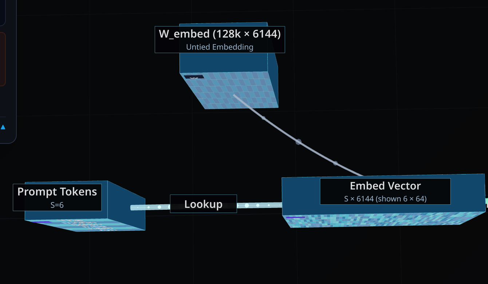
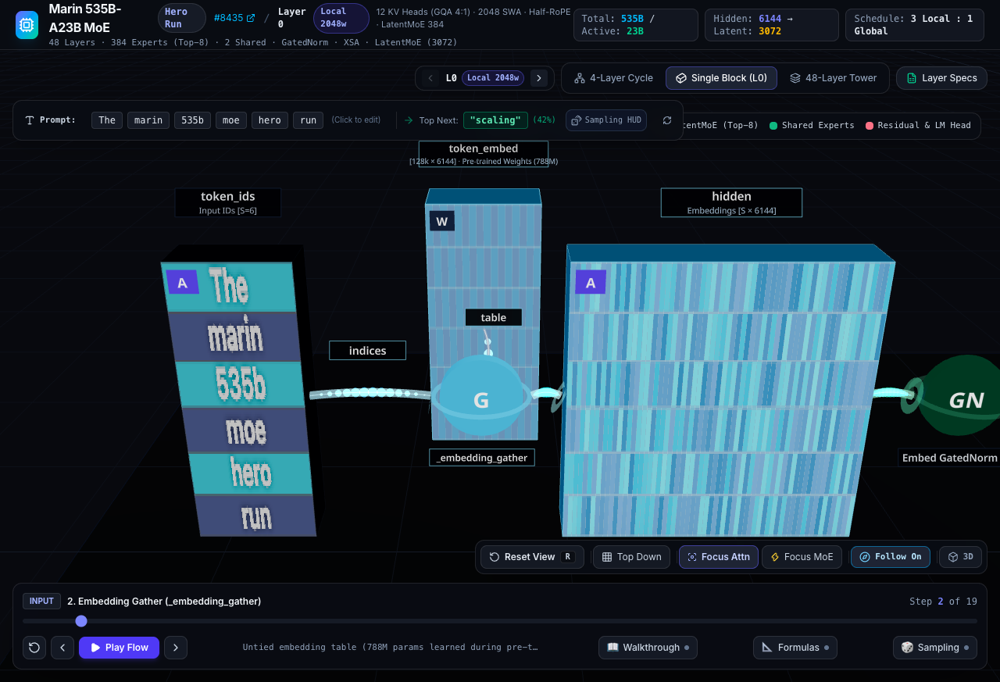

# Layer Semantics Verification & Architecture Fixes

## 1. Problem Statement: Misleading Token Lookup in Intermediate Layers

Prior to this refactor, all 48 Transformer layers in the visualizer displayed the full **Stage 1 (Token Embedding)** and **Stage 4 (LM Head)** components. For intermediate layers (e.g., Layer 6), displaying the token ID lookup (`W_embed`) and vocabulary logits (`W_out`) was architecturally incorrect and severely misleading. In a standard deep Transformer architecture, token embeddings only occur at layer 0, and the LM head projection only occurs after the final layer. All intermediate layers exclusively read from and write to the **Residual Stream**.

## 2. Solution: Dynamic Residual Stream Routing (Plan A)

We implemented "Plan A", resolving this discrepancy by introducing conditional rendering and dynamic steps driven by the current layer index:

*   **First Layer (L0):** Retains the standard Token Input, Untied Embedding (`W_embed`), and Initial GatedNorm representations.
*   **Intermediate Layers (L1 - L46):** Hides the token structures. Replaces the input with a dynamic **`Input from Layer N-1 (Residual Stream [S × 6144])`** node, flowing directly into the Pre-Attn GatedNorm. Hides the LM Head, routing the MoE output to a **`Output to Layer N+1 (Residual Stream [S × 6144])`** node.
*   **Final Layer (L47):** Retains the Untied LM Head and Output Logit projections.

## 3. Visual Before & After Comparison

### Before
*   
*   

### After
*   
*   

## 4. Technical Implementation Details

1.  **3D Component Rendering (`MicroBlockView.tsx`):**
    *   Dynamic floor text generation based on `isFirstLayer` and `isLastLayer`.
    *   Conditional masking of `node_tokens`, `node_w_embed`, `node_lm_head`, etc.
    *   Precise alignment of `FlowConnection` coordinates to eliminate clipping and floating gaps (e.g., `op_moe_add` to `node_residual_out` strictly bound to `x=35.55`).
    *   Removal of magic numbers by inferring `isLastLayer` via a generalized `totalLayers` prop.
2.  **State Management (`App.tsx` & `SceneContainer.tsx`):**
    *   `dynamicSteps` logic dynamically overrides Step 1~3 and Step 18~19 titles, descriptions, and `activeNodeIds`.
    *   Smooth camera focus rerouting for bypassed stages to prevent out-of-bounds rendering or crashing the UI.
3.  **Data Definitions (`equationData.ts`):**
    *   Integrated definitions for `node_residual_in` and `node_residual_out` metadata cards with LaTeX formulas ($x^{(l)} = x^{(l-1)} + \text{Attn}(x) + \text{MoE}(x)$) to maintain tooltip integrity during 3D inspections.

## 5. Embed Vector Centralization (Layer 0 Alignment)

In Layer 0, the `Embed Vector` (`node_embed`) and its adjacent flow connections were originally offset at $z=0.8$, causing the primary data pipeline (`Prompt Tokens` -> `Embed Vector` -> `Embed GatedNorm`) to appear bent and disjointed.

To resolve this, the node position and associated coordinate links were moved to the central axis ($z=0$):
- `node_embed` centered from $z=0.8$ to $z=0$.
- `Lookup` and `Embed Vector -> Embed GatedNorm` flow connections realigned to $z=0$.
- `W_embed Weight Flow` connection realigned seamlessly to $z=-0.35$ to avoid clipping into the centered vector.

### Visual Comparison
*   
*   

## 6. Prompt Tokens UV Artifact Elimination & Text Labeling

Previously, the `Prompt Tokens` box geometry exhibited misleading stretch artifacts (stripes) on its top face (+Y) because the 6-row front canvas texture was mapped uniformly across the entire cube. To viewers, this incorrectly suggested a 3D depth slice. Additionally, the front faces were solid color blocks devoid of lexical meaning.

We resolved this by:
- Employing a **Multi-Material array** for the `BoxGeometry` `[side, side, side, side, front, front]`. The top, bottom, and side faces now use a pristine, dark solid material, entirely eliminating the UV stretching artifacts.
- Dynamically rendering the actual token strings (e.g., "The", "marin", "535b", "moe", "hero", "run") directly onto the front-facing canvas grid with high-contrast drop shadows, providing immediate lexical context.

### Visual Comparison
*   
*   

## 7. Stage 1 Embedding Gather Convergence Topology & Pre-training Semantics

The previous Stage 1 visualization depicted an ambiguous data pipeline: `Prompt Tokens` were connected directly to `Embed Vector` through an opaque `Lookup` label, while `W_embed` hovered in the background with an oblique connection. This obscured how index gathering actually functions and created conceptual confusion.

To strictly align with the ground truth architecture in `marin-main` (`experiments/grug/moe/model.py` and `lib/levanter/.../snowball.py`), we reconstructed Stage 1 into a canonical dual-input gather convergence topology:

1. **Dual-Input Convergence Topology**:
   - **Indices Input (`token_ids`)**: At `[-16.5, 2.0, 0]`, representing discrete sequence IDs $t \in \{0, \dots, 128255\}^S$. Connects horizontally via the `indices` flow pipeline into the gather operator.
   - **Weight Table (`token_embed`)**: At `[-14.0, 2.0, -2.4]`, representing the untied embedding weight table of shape $[128256, 6144]$. Connects perpendicularly along the Z-axis via the `table` flow pipeline into the gather operator.
   - **Core Operator (`op_embed_gather`)**: Centered at `[-14.0, 2.0, 0]`, an explicit operator node labeled `_embedding_gather` executing $\text{hidden} = \text{Gather}(\text{token\_embed}, \text{token\_ids})$.
   - **Output Tensor (`hidden`)**: Centered at `[-11.5, 2.0, 0]`, receiving the gathered dense representations ($[S \times 6144]$) before flowing into `Embed GatedNorm`.

2. **Pre-training Attribution & Parameter Sizing**:
   - The embedding table comprises $128,256 \times 6,144 = 787,998,720$ parameters (~788M params).
   - In contrast to the static, rule-based BPE tokenizer vocabulary, these 788M continuous parameters are **randomly initialized and trained end-to-end via gradient backpropagation across 18 Trillion tokens during pre-training**.
   - The UI sublabel explicitly displays `[128k × 6144] · Pre-trained Weights (788M)` and is synchronized across `InspectorModal`, `equationData`, and the `Narrator`.

### Visual Comparison
*   
*   

