# Layer Semantics Verification & Architecture Fixes

## 1. Problem Statement: Misleading Token Lookup in Intermediate Layers

Prior to this refactor, all 48 Transformer layers in the visualizer displayed the full **Stage 1 (Token Embedding)** and **Stage 4 (LM Head)** components. For intermediate layers (e.g., Layer 6), displaying the token ID lookup (`W_embed`) and vocabulary logits (`W_out`) was architecturally incorrect and severely misleading. In a standard deep Transformer architecture, token embeddings only occur at layer 0, and the LM head projection only occurs after the final layer. All intermediate layers exclusively read from and write to the **Residual Stream**.

## 2. Solution: Dynamic Residual Stream Routing (Plan A)

We implemented "Plan A", resolving this discrepancy by introducing conditional rendering and dynamic steps driven by the current layer index:

*   **First Layer (L0):** Retains the standard Token Input, Untied Embedding (`W_embed`), and Initial GatedNorm representations.
*   **Intermediate Layers (L1 - L46):** Hides the token structures. Replaces the input with a dynamic **`Input from Layer N-1 (Residual Stream [S × 6144])`** node, flowing directly into the Pre-Attn GatedNorm. Hides the LM Head, routing the MoE output to a **`Output to Layer N+1 (Residual Stream [S × 6144])`** node.
*   **Final Layer (L47):** Retains the Untied LM Head and Output Logit projections.

## 3. Visual Before & After Comparison

### Before
*   
*   

### After
*   
*   

## 4. Technical Implementation Details

1.  **3D Component Rendering (`MicroBlockView.tsx`):**
    *   Dynamic floor text generation based on `isFirstLayer` and `isLastLayer`.
    *   Conditional masking of `node_tokens`, `node_w_embed`, `node_lm_head`, etc.
    *   Precise alignment of `FlowConnection` coordinates to eliminate clipping and floating gaps (e.g., `op_moe_add` to `node_residual_out` strictly bound to `x=35.55`).
    *   Removal of magic numbers by inferring `isLastLayer` via a generalized `totalLayers` prop.
2.  **State Management (`App.tsx` & `SceneContainer.tsx`):**
    *   `dynamicSteps` logic dynamically overrides Step 1~3 and Step 18~19 titles, descriptions, and `activeNodeIds`.
    *   Smooth camera focus rerouting for bypassed stages to prevent out-of-bounds rendering or crashing the UI.
3.  **Data Definitions (`equationData.ts`):**
    *   Integrated definitions for `node_residual_in` and `node_residual_out` metadata cards with LaTeX formulas ($x^{(l)} = x^{(l-1)} + \text{Attn}(x) + \text{MoE}(x)$) to maintain tooltip integrity during 3D inspections.

## 5. Embed Vector Centralization (Layer 0 Alignment)

In Layer 0, the `Embed Vector` (`node_embed`) and its adjacent flow connections were originally offset at $z=0.8$, causing the primary data pipeline (`Prompt Tokens` -> `Embed Vector` -> `Embed GatedNorm`) to appear bent and disjointed.

To resolve this, the node position and associated coordinate links were moved to the central axis ($z=0$):
- `node_embed` centered from $z=0.8$ to $z=0$.
- `Lookup` and `Embed Vector -> Embed GatedNorm` flow connections realigned to $z=0$.
- `W_embed Weight Flow` connection realigned seamlessly to $z=-0.35$ to avoid clipping into the centered vector.

### Visual Comparison
*   
*   

## 6. Prompt Tokens UV Artifact Elimination & Text Labeling

Previously, the `Prompt Tokens` box geometry exhibited misleading stretch artifacts (stripes) on its top face (+Y) because the 6-row front canvas texture was mapped uniformly across the entire cube. To viewers, this incorrectly suggested a 3D depth slice. Additionally, the front faces were solid color blocks devoid of lexical meaning.

We resolved this by:
- Employing a **Multi-Material array** for the `BoxGeometry` `[side, side, side, side, front, front]`. The top, bottom, and side faces now use a pristine, dark solid material, entirely eliminating the UV stretching artifacts.
- Dynamically rendering the actual token strings (e.g., "The", "marin", "535b", "moe", "hero", "run") directly onto the front-facing canvas grid with high-contrast drop shadows, providing immediate lexical context.

### Visual Comparison
*   
*   

## 7. Stage 1 Embedding Gather Convergence Topology & Pre-training Semantics

The previous Stage 1 visualization depicted an ambiguous data pipeline: `Prompt Tokens` were connected directly to `Embed Vector` through an opaque `Lookup` label, while `W_embed` hovered in the background with an oblique connection. This obscured how index gathering actually functions and created conceptual confusion.

To strictly align with the ground truth architecture in `marin-main` (`experiments/grug/moe/model.py` and `lib/levanter/.../snowball.py`), we reconstructed Stage 1 into a canonical dual-input gather convergence topology:

1. **Dual-Input Convergence Topology**:
   - **Indices Input (`token_ids`)**: At `[-16.5, 2.0, 0]`, representing discrete sequence IDs $t \in \{0, \dots, 128255\}^S$. Connects horizontally via the `indices` flow pipeline into the gather operator.
   - **Weight Table (`token_embed`)**: At `[-14.0, 2.0, -2.4]`, representing the untied embedding weight table of shape $[128256, 6144]$. Connects perpendicularly along the Z-axis via the `table` flow pipeline into the gather operator.
   - **Core Operator (`op_embed_gather`)**: Centered at `[-14.0, 2.0, 0]`, an explicit operator node labeled `_embedding_gather` executing $\text{hidden} = \text{Gather}(\text{token\_embed}, \text{token\_ids})$.
   - **Output Tensor (`hidden`)**: Centered at `[-11.5, 2.0, 0]`, receiving the gathered dense representations ($[S \times 6144]$) before flowing into `Embed GatedNorm`.

2. **Pre-training Attribution & Parameter Sizing**:
   - The embedding table comprises $128,256 \times 6,144 = 787,998,720$ parameters (~788M params).
   - In contrast to the static, rule-based BPE tokenizer vocabulary, these 788M continuous parameters are **randomly initialized and trained end-to-end via gradient backpropagation across 18 Trillion tokens during pre-training**.
   - The UI sublabel explicitly displays `[128k × 6144] · Pre-trained Weights (788M)` and is synchronized across `InspectorModal`, `equationData`, and the `Narrator`.

### Visual Comparison
*   
*   

## 8. Residual Skip Bridge Anchoring & Pre-Norm Mathematical Rectification

In standard Pre-Norm Transformers ($x \leftarrow x + \text{Attention}(\text{Norm}(x))$ and $x \leftarrow x + \text{MoE}(\text{Norm}(x))$), the identity residual skip path must carry the **un-normalized primary backbone signal**. 

Previously, both residual skip arches in `MicroBlockView.tsx` were incorrectly anchored:
- `Residual Skip 1` was anchored to `Pre-Attn GatedNorm` ($x = -6.8$), implying normalized activation was passed down the skip connection.
- `MoE Residual Skip` was anchored to `Pre-MoE GatedNorm` ($x = 16.1$), violating the post-attention un-normalized identity invariant.

### Rectifications Implemented:
1. **Attention Residual Skip (`Residual Skip 1`)**:
   - In Layer 0 (`isFirstLayer`): Re-anchored to takeoff directly from the output of `Embed GatedNorm` (`op_embed_gn`, $x = -8.8$).
   - In Layers 1-47 (`!isFirstLayer`): Re-anchored to takeoff directly from `node_residual_in` ($x = -9.85$).
   - Coordinates: `from={[isFirstLayer ? -8.8 : -9.85, 2.45, 0]}`.
   - Highlighting bounds: `[isFirstLayer ? 'op_embed_gn' : 'node_residual_in', 'op_attn_add']`.
2. **MoE Residual Skip (`MoE Residual Skip`)**:
   - Re-anchored to takeoff from the Attention aggregation adder `op_attn_add` ($x = 13.5$), carrying the accumulated post-attention backbone stream.
   - Coordinates: `from={[13.5, 2.45, 0]}` to `[35.0, 2.45, 0]`.
   - Highlighting bounds: `['op_attn_add', 'op_moe_add']`.

### Visual Comparison
*   
*   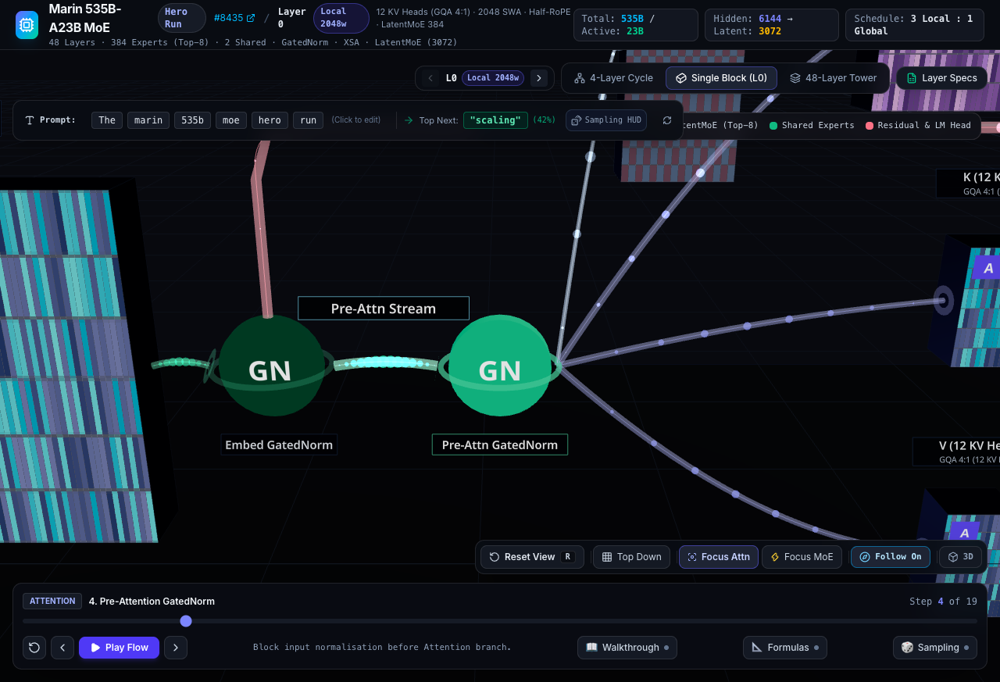

## 9. Pre-Attn GatedNorm Depth Offset & Residual Backbone Decoupling

Previously, `Pre-Attn GatedNorm` (`op_attn_gn`) was positioned at `[-6.8, 2.0, 0]` directly along the primary central axis ($Z=0$). In both perspective and top-down views, the main residual highway bridge (`Residual Skip 1 [6144]`) directly superimposed over the node, obscuring visual hierarchy and falsely suggesting the residual stream flowed into or through the pre-attention normalizer.

To decouple the primary backbone highway from the attention side-branch, we shifted `op_attn_gn` deeper along the Z-axis:

1. **Spatial Depth Offset**:
   - `op_attn_gn` shifted from $Z=0$ to $Z=-2.0$ (`position={[-6.8, 2.0, -2.0]}`).
   - Centered $Z=0$ is now exclusively reserved for the primary residual stream and its overhead skip connection.

2. **Branching Off Dataflow Alignment**:
   - **Layer 0 (`isFirstLayer`)**: Signal diverges from `op_embed_gn` (`[-8.25, 2.0, 0]`) and branches off diagonally into `op_attn_gn` (`[-7.35, 2.0, -2.0]`), labeled `Pre-Attn Stream`.
   - **Layers 1-47 (`!isFirstLayer`)**: Signal diverges from `node_residual_in` (`[-9.85, 2.0, 0]`) into `[-7.35, 2.0, -2.0]`.

3. **Coplanar Projection Alignment with QKV**:
   - Downstream connections to `node_q` ($Z=-2.0$) and `node_k` ($Z=-2.0$) now travel strictly coplanar in the $Z=-2.0$ 2D slice, providing pristine geometric cleanliness.

4. **Camera Tracking Calibration**:
   - In `stepDefinitions.ts`, Step 4 camera focus updated to `[-6.8, 2.0, -2.0]` and position to `[-6.8, 5.0, 6.0]`.

### Visual Comparison
*   
*   
*   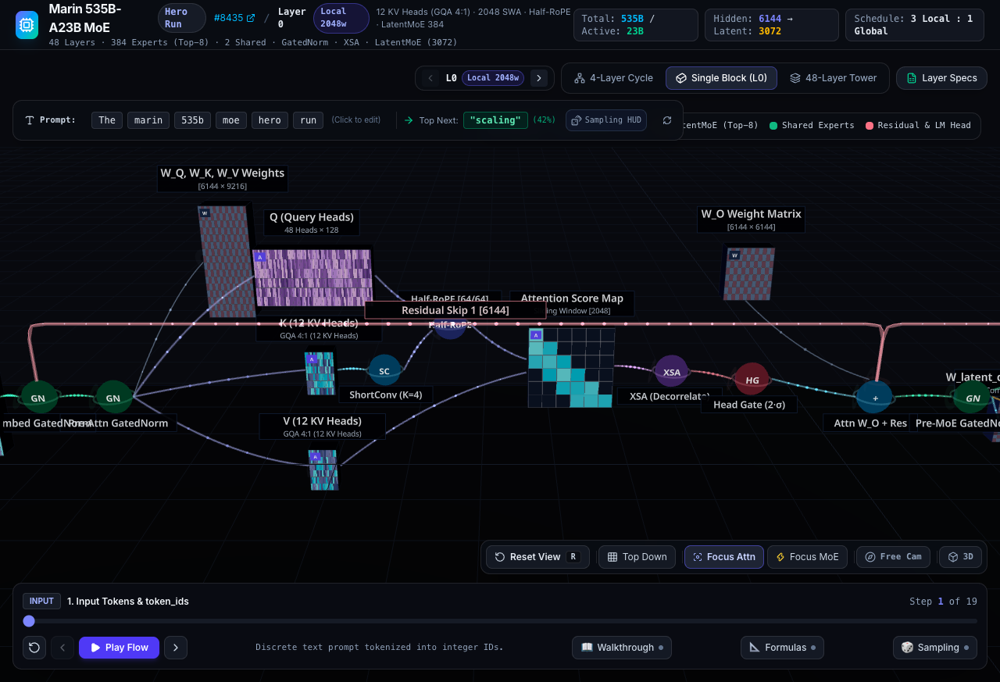
*   

## 10. Residual Bus & Unified Split Hub (Corner De-uglification)

In non-first layers ($l > 0$), `Residual Skip 1` was previously anchored directly to the right edge of `node_residual_in` (`[-9.85, 2.45, 0]`). Because the tensor matrix is tall ($Y \in [0.4, 3.6]$), the high-altitude skip arch climbed vertically immediately adjacent to the box's top-right corner, resembling a cramped, awkward "chimney pipe" that collided with the `Input from L...` HUD banner. Concurrently, a second pipe branched diagonally downward from the same surface, creating visual clutter and eliminating breathing room.

### Rectifications Implemented:
1. **Single Pristine Residual Bus**:
   - The right face of `node_residual_in` (`[-9.85, 2.0, 0]`) now emits a **single, horizontal cyan backbone bus** (`Residual Bus`) extending 1.05 units to a dedicated split junction at `[-8.8, 2.0, 0]`.
   - Eliminates all cramped corner pipes and keeps the tensor label completely un-clipped.

2. **Unified High-Altitude Arch Anchor ($X = -8.8$)**:
   - Across **all layers** (Layer 0 through Layer 47), `Residual Skip 1` now launches consistently from $X = -8.8$ (`[-8.8, 2.45, 0]`), providing stable architectural continuity when switching layers.

3. **Diagonal Pre-Attn Branch**:
   - From the split junction (`[-8.8, 2.0, 0]`), a single diagonal pipe branches smoothly toward `op_attn_gn` at `[-7.35, 2.0, -2.0]`, delivering pristine geometric symmetry and industrial pipeline clarity.

### Visual Comparison
*   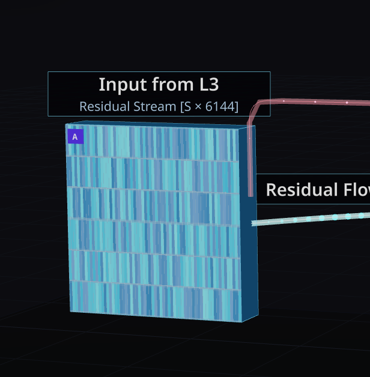
*   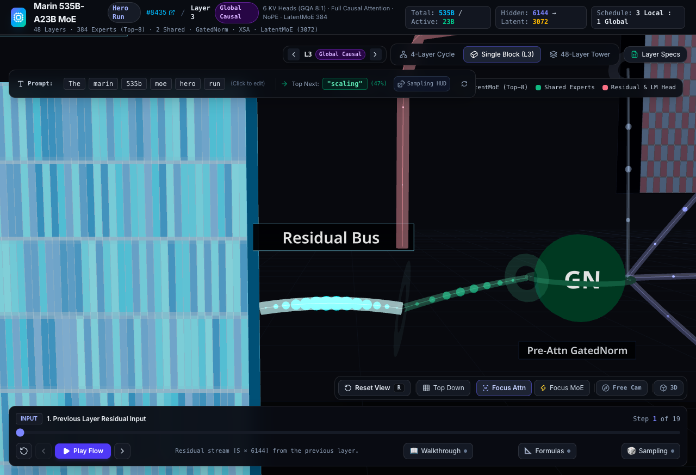

## 11. Final Geometric Realignments & Inspector Synchronization

Following intensive review, three critical spatial and conceptual inconsistencies were identified and resolved to achieve perfect industrial-grade geometric precision and rigorous mathematical formulation:

### 11.1 Residual Bus Elevation Gap Closure
In intermediate layers, the `Residual Skip 1` high-altitude bypass connection exhibited a noticeable 0.45-unit vertical disconnection from the main `Residual Bus` (originating at `Y=2.45` while the bus was at `Y=2.0`). This caused the connection line to appear floating and disjointed.
- **Fix:** We dynamically adjusted the Y-coordinate of the `from` vector in `Residual Skip 1` based on the layer index: `from={[-8.8, isFirstLayer ? 2.45 : 2.0, 0]}`. This guarantees that for non-first layers, the bridge roots itself perfectly onto the horizontal backbone highway.

### 11.2 Attention Branch Coplanarity
The `node_v` (Value projection matrix) was previously situated at `Z = -1.5`, while `node_q` and `node_k` were aligned at `Z = -2.0`. This broke the coplanar symmetry of the Attention mechanism's QKV projection stage.
- **Fix:** We unified the spatial layout by shifting `node_v` and its incoming connections to `Z = -2.0`. The entire QKV processing manifold now resides cleanly within a single 2D plane offset from the main residual backbone, eliminating any diagonal distortion when viewed from orthographic angles.

### 11.3 Strict Pre-Norm Formulation and Inspector Synchronization
The mathematical definitions defining the residual boundaries were lacking rigorous notation. Furthermore, navigating between layers caused the `InspectorModal` to stall on stale node references due to missing React Hook dependencies.
- **Fix:** We introduced `node_residual_in` and `node_residual_out` into the `INSPECTION_DATA` dictionary, detailing their roles in carrying accumulated identity representations.
- **Fix:** We updated the `node_residual_out` metadata in `equationData.ts` to explicitly define the mathematically precise Pre-Norm Transformer formulation: 
  $x^{(l)} = x^{(l-1)} + \text{Attn}(\text{GatedNorm}_1(\text{RMSNorm}(x))) + \text{MoE}(\text{GatedNorm}_2(\text{RMSNorm}(x + \dots)))$.
- **Fix:** We patched the synchronization `useEffect` inside `App.tsx` by including `selectedLayerIndex` and `activeStep.activeNodeIds` in its dependency array. The inspector HUD now reliably refreshes and binds to the active node upon layer transition without ghostly retention of bypassed structures.

### Visual Comparison
*   
*   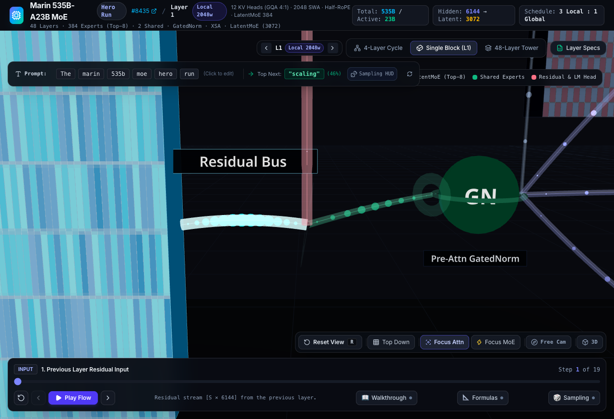

## 12. Attention Pipeline Coplanar Alignment (Z = -2.0 Dual-Lane Highway)

Subsequent visual verification identified a fragmented, stair-step spatial offset in the latter half of the Attention processing pipeline. Specifically, the operators and tensors were drifting across the Z-axis: the Attention Score Map was at Z = -1.8, XSA (Exclusive Self-Attention) at Z = -1.4, Head Gate at Z = -0.8, and the W_O projection weight at Z = -2.4.

To eliminate this clutter and establish pristine industrial-grade geometric order, the entire pipeline was collapsed into a strict coplanar alignment:
- All operators and tensors in the downstream Attention branch (`node_attn_matrix`, `op_xsa`, `op_head_gate`, `node_w_o`) were unified and anchored exclusively at Z = -2.0.
- All interconnected dataflow pipelines now traverse in perfect horizontal parallelism along the Z = -2.0 plane before their final diagonal convergence into the residual backbone at Z = 0.

This introduces a "Dual-Lane Parallel Highway" paradigm, providing viewers with an unobstructed, side-by-side comparison of the pure identity backbone against the active processing branch.

### Visual Comparison
*   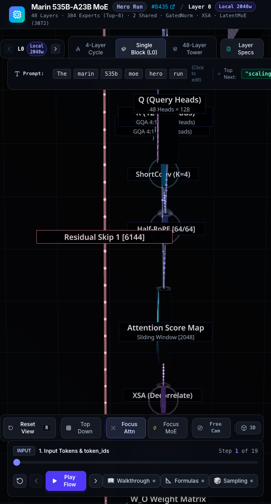

## 13. Symmetrical Dual-Wing & Collision-Free Alignment for Latent MoE

A critical architectural refactoring was executed on the Stage 3 (Latent MoE) 3D topology to resolve intersection collisions and establish a visually clean, symmetrical dual-wing design. 

The previous layout suffered from overlapping components and crossed wires, which obfuscated the complex gating and routing mechanism. We resolved this by physically separating the logic into two distinct parallel lanes flanking the main residual backbone (`Z = 0`):

- **Lane A (Z = +2.5) — Routing & Shared Capacity:** The Router Weights (`node_w_router`), Router Operator (`node_router`), QB Dispatch (`op_router_qb`), and the 2 high-capacity Shared Experts (`node_experts_shared`) were cleanly shifted to the `+2.5` positive Z-axis coordinate.
- **Lane B (Z = -2.5) — Latent Compression & Routed Dispatch:** The Latent Compression Weights (`node_w_latent_down`), Compressed Vector (`node_latent_down`), Latent RMSNorm (`op_latent_norm`), the 8 dynamic Routed Experts (`node_experts_routed`), and the Up-Projection Weights (`node_w_latent_up`) were symmetrically shifted to the `-2.5` negative Z-axis coordinate.

This "butterfly" configuration prevents routing flows from colliding. Furthermore, the dispatch connection from the `QB Router` to the `8 Routed Experts` is now rendered as a cross-axis **Gating Beam** arching over the residual backbone with a curved trajectory (`curveHeight=1.2`), explicitly showcasing the dynamic conditional dispatch mechanism without intersection. Finally, both the Shared Experts and Up-Projected Latent outputs symmetrically converge back into the `MoE Add (Σ)` node at the main `Z = 0` highway.

### Visual Comparison
*   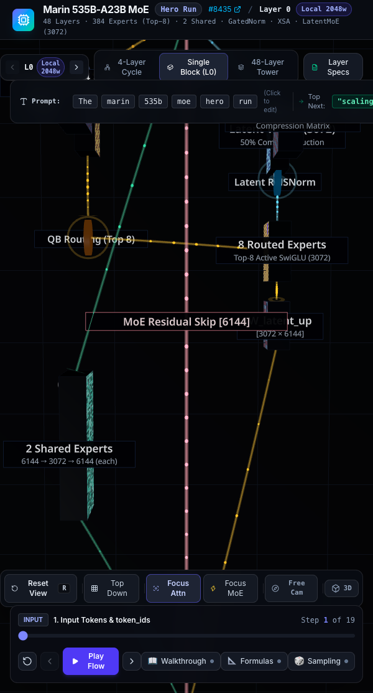

## 14. MoE Spatial Spread & Staggered Footprint Refactoring

Building upon the strict Z-axis symmetry established in Section 13, a subsequent pass was executed to fully utilize the X-axis dimensional space (`X = 16.0` to `36.5`), permanently resolving any lingering visual congestion or component overlapping within the Latent MoE branch.

- **Alternating Staggered Layout**: Components within Lane A (Z = +2.5) and Lane B (Z = -2.5) are now physically staggered along the X-axis rather than tightly clustered. The Lane A `Router` components are positioned earlier (X=19.5 to 23.5), while the Lane B `Latent Down` and `Routed Experts` components are shifted further downstream (X=22.0 to 29.5).
- **Clearance and Interleaving**: This precise horizontal spacing guarantees that no two heavy tensor matrices overlap diagonally when viewed from a perspective angle. The structural void created by Lane A's earlier completion elegantly accommodates Lane B's sprawling 8-expert matrix block.
- **Dynamic Gating Beam Extension**: The `QB Router` cross-axis gating beam (dispatched from X=23.5) now naturally stretches further downstream to reach the `Routed Experts` (X=29.5), creating a majestic, sweeping rainbow arch (`curveHeight=1.4`) that vividly illustrates conditional routing dispatch without intersecting physical modules.
- **Synchronized Convergence Point**: The final convergence location `op_moe_add` was micro-adjusted to `X=36.5` (zeroed at Z=0) to act as the perfect terminal basin for the sprawling upstream parallel flow, ensuring all high-altitude (`MoE Residual Skip`) and symmetric branch flows dock immaculately.

### Visual Comparison
*   **Focus MoE / Perspective**:
    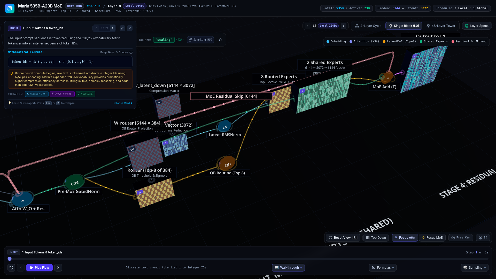
*   **Top-Down Orthographic View**:
    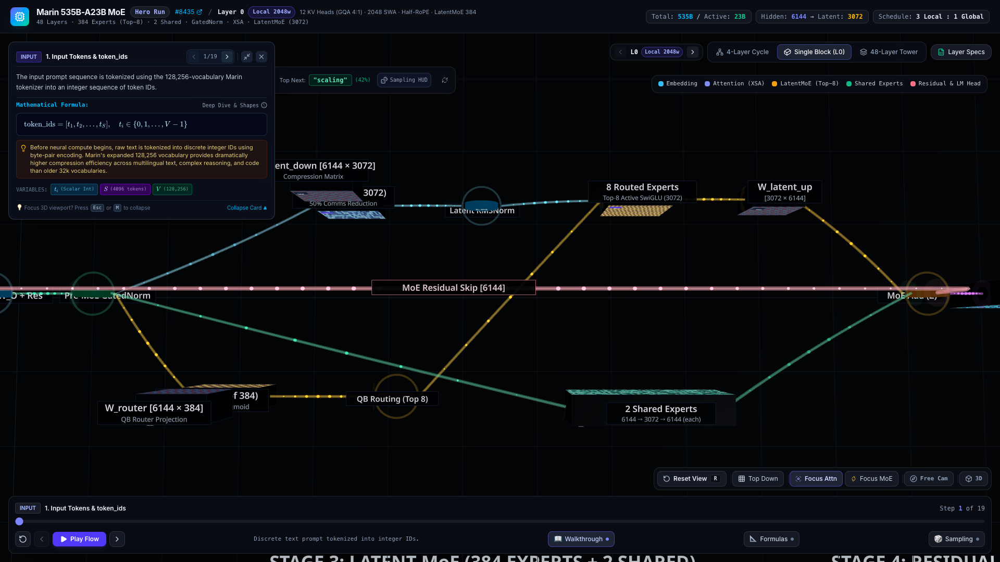

## 15. Anti-Gravity Global Elevation Refactoring (ΔY = +2.0)

During final spatial review, it was observed that several bottom-aligned tensor matrices (specifically `node_v` in the Attention stage and `node_latent_down` / `Latent RMSNorm` in the MoE stage) were intersecting or sinking below the `Y=0` obsidian ground platform plane. Furthermore, bottom-anchored text labels were being visually occluded by the ground mesh.

To correct this and achieve a pristine floating architectural design, a global "anti-gravity" elevation refactoring was implemented:

- **Global Computational Plane Lift**: Every single operational node, weight matrix, flow connection, and residual skip bridge across all four processing stages (Stage 1 to Stage 4) was wrapped within a unified coordinate group and elevated by `ΔY = +2.0`. 
- **Anchored Ground Floor**: The structural dark slate ground platform and stage demarcation labels were kept at their absolute original coordinates (`Y=-1.8` and `Y=-1.72`), acting as the absolute foundational bedrock. 
- **Perfect Clearances**: The lowest-hanging components (which extend downwards by half their height, approx 1.45 units) now clear the ground floor by a comfortable `0.55` unit minimum margin. Bottom-anchored text labels hang cleanly in the void between the modules and the ground, eliminating all mesh clipping.
- **Synchronized Camera Tracking**: All 19 pre-defined step camera waypoints in the temporal sequencer (`stepDefinitions.ts`) and global interactive camera defaults (`App.tsx`) were uniformly incremented by `+2.0` on the Y-axis. This guarantees that auto-follow camera tracking remains perfectly centered on the newly elevated logic plane without any vertical drift.

### Visual Comparison
*   **Stage 2 (Attention) - Clearance Validation**:
    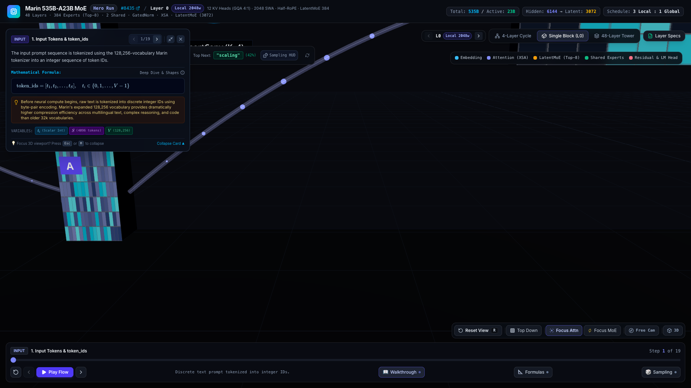
*   **Stage 3 (Latent MoE) - Ground Clearance Validation**:
    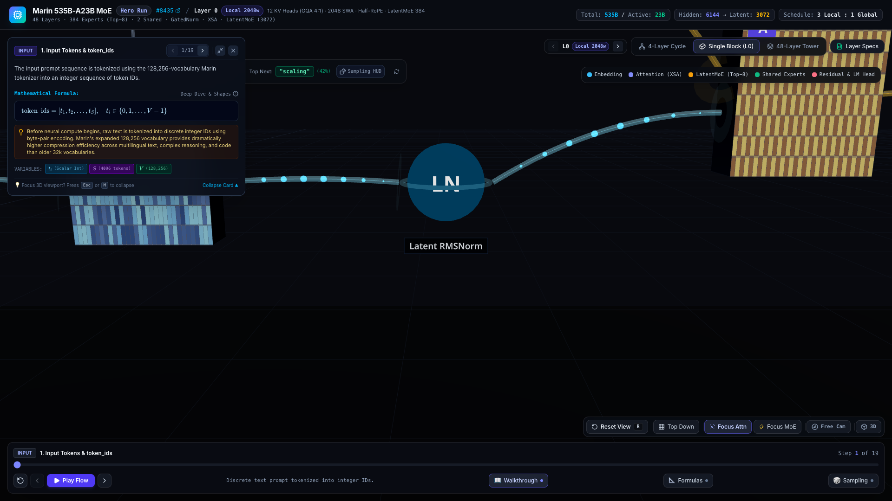
